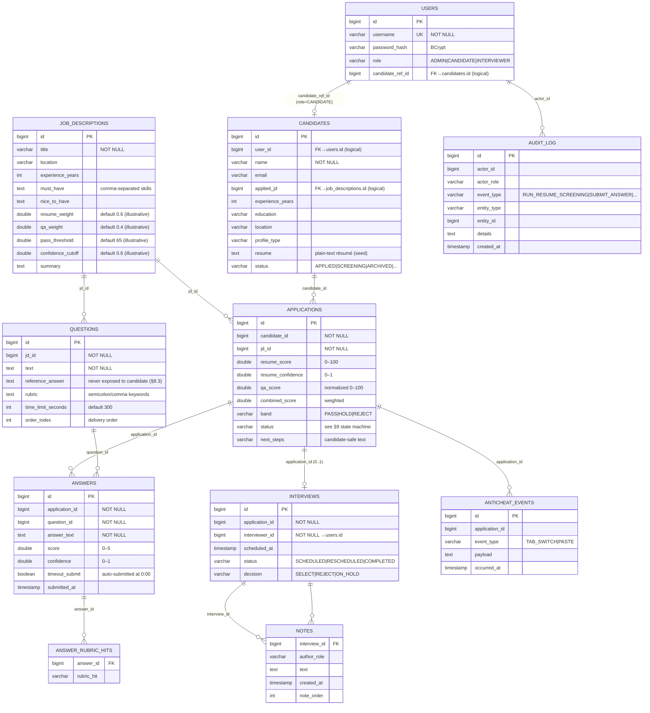
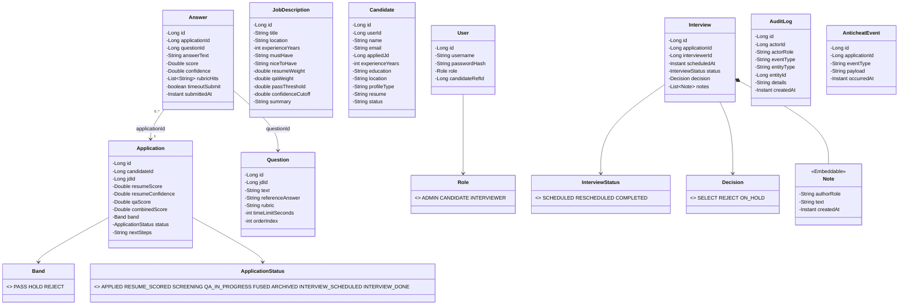
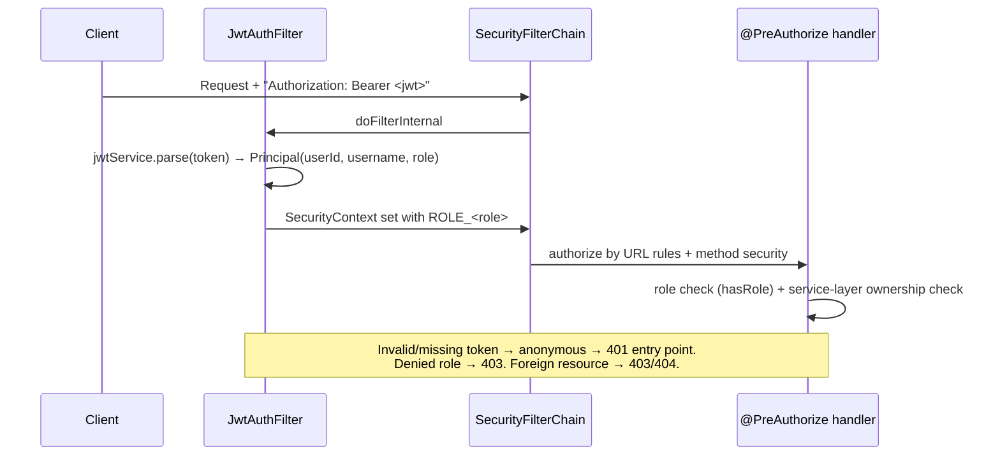
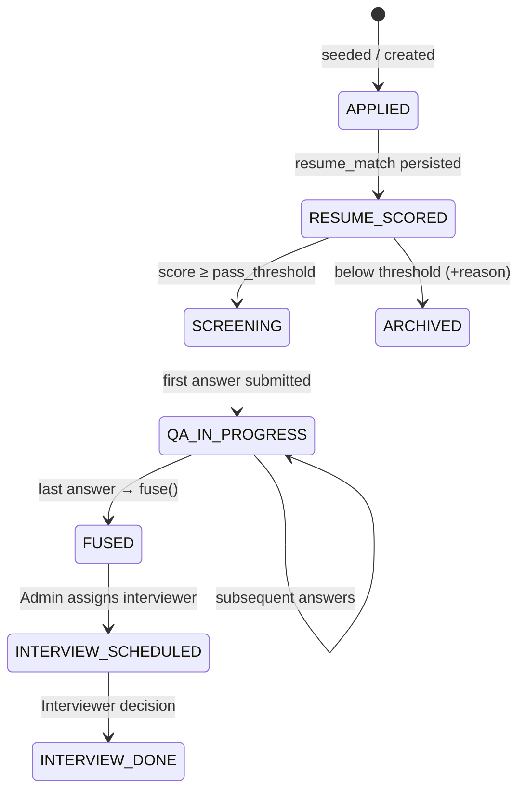

# SmartHire — LLD & Data Model (Java/Spring Boot implementation) `_glm_5.3`

> Low-Level Design grounded 1:1 in the **actual code** in `smarthire/smarthire-java-sb/`.
> Source of truth for requirements: *SmartHire_Technical_Specification_and_Architecture.docx v1.0* (§ references throughout).
> Diagrams: [Mermaid](https://mermaid.js.org/) — render in GitHub / VS Code Mermaid preview.

---

## Table of Contents
1. [Package Architecture (as-built)](#1-package-architecture)
2. [Data Model — ER Diagram](#2-data-model--er-diagram)
3. [Table Specifications (as-built DDL)](#3-table-specifications)
4. [Entity Class Diagram](#4-entity-class-diagram)
5. [Service Layer Design — method contracts](#5-service-layer-design)
6. [Controller → Service → Repository traceability](#6-api-traceability)
7. [Security LLD](#7-security-lld)
8. [AI Layer LLD](#8-ai-layer-lld)
9. [State Machines](#9-state-machines)
10. [Design Patterns & Rationale](#10-design-patterns)

---

## 1. Package Architecture

```
com.smarthire
├── SmartHireApplication          # @SpringBootApplication entry point
├── api/                          # REST boundary — @RestController, DTO records only
│   ├── AuthController            # POST /api/login
│   ├── JdController              # GET/POST/PUT /api/jds[...]
│   ├── ScreeningController       # GET /api/candidates · POST /api/jds/{id}/resume-score
│   ├── ApplicationController     # /api/applications/{id}[/questions|answers|assign-interviewer|decision|notes]
│   ├── InterviewerController     # GET /api/interviewer/assignments
│   ├── FlagController            # GET /api/flags · POST /api/anticheat
│   └── AuditController           # GET /api/audit
├── domain/                       # JPA @Entity classes + enums (no logic beyond domain)
├── repository/                   # Spring Data JPA interfaces (9)
├── service/                      # @Service business logic (@Transactional)
│   ├── AuthService               # §10 credential check + token issue
│   ├── ScreeningService          # §7.1 batch résumé scoring
│   ├── QaService                 # §7.2 Q&A + §7.3 fusion
│   ├── InterviewService          # §7.4 assignment/decision/notes
│   ├── FlagService               # §12 flag computation
│   ├── AccessService             # ownership/visibility rules (§8.3, §11)
│   └── AuditService              # §5 Audit Module
├── ai/
│   ├── LlmClient                 # port interface + static validateOrRetryOnce guardrail
│   ├── MockLlmClient             # @Primary offline provider
│   └── ControlledLlmException    # §8.3/§13 controlled error
├── security/
│   ├── JwtService                # HS256 issue/parse (sub, username, role claims)
│   ├── JwtAuthFilter             # OncePerRequestFilter → SecurityContext
│   └── SecurityConfig            # filter chain, stateless, @EnableMethodSecurity
└── config/
    └── CorsConfig                # allows Vite dev origin :5173
```

**Dependency rule:** `api → service → (repository | ai)`; `security` wraps `api`;
`domain` is referenced by all but depends on nothing. No cycles.

---

## 2. Data Model — ER Diagram



### Relationship cardinalities (docx §6 mapping)

| Relation | Cardinality | Implemented as |
|---|---|---|
| User → Candidate | 1 : 0..1 | `users.candidate_ref_id` (only when role=CANDIDATE) |
| JD → Question | 1 : 0..* | `questions.jd_id` (+`order_index`) |
| Candidate → Application | 1 : 1..* | `applications.candidate_id`, UNIQUE `(candidate_id, jd_id)` |
| Application → Answer | 1 : 0..* | `answers.application_id`, UNIQUE `(application_id, question_id)` |
| Application → Interview | 1 : 0..1 | `interviews.application_id` (assigned later in lifecycle) |
| Interview → Note | 1 : 0..* | `notes.interview_id` (@Embeddable list) |

> Note on FKs: the seed DDL uses **logical references** (no `FOREIGN KEY` constraints) —
> this is intentional demo simplification; the UNIQUE constraints carry the integrity
> rules. For a production profile, add explicit FK constraints in a later migration.

---

## 3. Table Specifications

As-built `V1__init.sql` (11 tables). Highlights & integrity rules:

| Table | PK | Unique | Notable columns | Rule source |
|---|---|---|---|---|
| `users` | id | `username` | `role` enum-as-string | §10 hard-coded demo users |
| `job_descriptions` | id | — | weights + thresholds per JD | §2 configurable scoring |
| `questions` | id | — | `reference_answer`, `rubric`, `time_limit_seconds` | §6, §7.2 |
| `candidates` | id | — | `resume` TEXT, `status` | §6 candidate fields |
| `applications` | id | `uq_application (candidate_id, jd_id)` | all score fields + band + status | §6, §7.3 |
| `answers` | id | `uq_answer (application_id, question_id)` | `timeout_submit` flag | §7.2 |
| `answer_rubric_hits` | — | — | join table (ElementCollection) | §6 rubric_hits[] |
| `interviews` | id | — | `decision` nullable until recorded | §7.4 |
| `notes` | — | — | `author_role`, `created_at` | §9 timestamped notes |
| `audit_log` | id | — | append-only event stream | §5 Audit Module |
| `anticheat_events` | id | — | telemetry payloads | §12 |

**Seeding (`V2__seed.sql`)** — replays on every boot because H2 is in-memory:
3 users (BCrypt of `admin123`), 1 JD, 2 questions, 1 candidate with résumé text.

---

## 4. Entity Class Diagram



Design choices in entities:
- **IDs as `Long` + `GenerationType.IDENTITY`** — H2/Postgres identity columns; simple, portable.
- **Score fields nullable (`Double`)** — distinguish "not yet scored" from 0.
- **Enums stored as STRING** (`@Enumerated(EnumType.STRING)`) — readable rows, safe evolution.
- **`Interview.Note` as @Embeddable + ElementCollection** — notes are value objects; no independent lifecycle.
- **No bidirectional relations** — unidirectional FKs keep JPQL simple and avoid N+1 traps in a demo.

---

## 5. Service Layer Design

### 5.1 ScreeningService (§7.1)

```java
@Transactional
public BatchResult screenJd(Long jdId)
```

| Aspect | Design |
|---|---|
| Input | `jdId` (validated to exist) |
| Algorithm | fetch candidates by `appliedJd` → per candidate: build JD text → `llm.resumeMatch()` → persist scores **then** status (§13 ordering) |
| Outcomes per row | `SCREENING` (score ≥ threshold) · `ARCHIVED` (with reason string) · `FAILED` (ControlledLlmException caught; batch continues) |
| Output | `BatchResult(jdId, scored, promoted, archived, failed, rows[])` |
| Audit | `RUN_RESUME_SCREENING` with batch stats |

Domain rule embedded: **score persistence precedes status mutation**; both inside one
transaction so partial state is impossible.

### 5.2 QaService (§7.2 + §7.3)

| Method | Contract |
|---|---|
| `getQuestions(applicationId)` | Guards status ∈ {SCREENING, QA_IN_PROGRESS}; returns questions `skip(answeredCount)` — implements **one-question-at-a-time** server-side |
| `submitAnswer(appId, qId, text, timeout)` | Rejects duplicate answers (UNIQUE + explicit check), calls `llm.answerScore`, persists `Answer` (score/confidence/rubricHits/timeout flag) **before** status change; on last question triggers `fuse()` |
| `fuse(applicationId)` | `qaNorm = avg(score)/5 × 100` → `combined = w_r × resume + w_q × qaNorm` → band: `≥ threshold → PASS`, `≥ 0.8 × threshold → HOLD`, else `REJECT` — human review still required (§7.3) |

Boundary semantics of the band rule (test-worthy): threshold 65 → `[65,∞) PASS`,
`[52,65) HOLD`, `<52 REJECT`.

### 5.3 InterviewService (§7.4)

| Method | Contract |
|---|---|
| `assign(appId, interviewerId, when)` | Upsert interview row (re-assign = RESCHEDULED path), app status → INTERVIEW_SCHEDULED, audit `ASSIGN_INTERVIEWER` |
| `assignmentsSorted(interviewerId)` | Query-scoped by interviewer — **assignment isolation is a WHERE clause, not UI filtering** |
| `recordDecision(appId, decision, principal)` | Asserts access (ADMIN or the assigned interviewer), sets decision + COMPLETED, updates app.next_steps, audit `RECORD_DECISION` |
| `addNote(appId, text, authorRole)` | Appends timestamped @Embeddable note, audit `ADD_NOTE` |

### 5.4 AccessService (visibility matrix §8.3/§11)

| Role | Rule enforced by `assertCanViewApplication` |
|---|---|
| ADMIN | all applications |
| CANDIDATE | only where `candidate.user_id == principal.userId` |
| INTERVIEWER | only where an `Interview` row exists with `interviewer_id == principal.userId` |

Applied on every `/api/applications/**` read/write — role check (`@PreAuthorize`)
and **ownership check** are separate layers by design.

### 5.5 FlagService (§12) — computed, not stored

Flags are **derived on read** from three predicates:
1. `resume_confidence < 0.6` → `LOW_CONFIDENCE`
2. `|resume_score − qa_score| > 30` → `SCORE_DIVERGENCE`
3. any `anticheat_events` rows → `ANTICHEAT_TELEMETRY`

No flag is persisted as a rejection; nothing feeds back into scoring automatically.

---

## 6. API → Service traceability

| Endpoint (§9) | Controller | Service call | Repository touchpoints |
|---|---|---|---|
| POST /api/login | AuthController | AuthService.login | UserRepository |
| GET/POST/PUT /api/jds… | JdController | (inline CRUD) | JdRepository |
| GET /api/candidates | ScreeningController | — | CandidateRepository |
| POST /api/jds/{id}/resume-score | ScreeningController | ScreeningService.screenJd | Candidate, Application |
| GET /api/applications/{id} | ApplicationController | AccessService.assert… | Application |
| GET …/questions | ApplicationController | QaService.getQuestions | Question, Answer |
| POST …/answers | ApplicationController | QaService.submitAnswer | Answer, Question, Application |
| POST …/assign-interviewer | ApplicationController | InterviewService.assign | Interview, Application |
| POST …/decision | ApplicationController | InterviewService.recordDecision | Interview, Application |
| POST …/notes | ApplicationController | InterviewService.addNote | Interview |
| GET /api/interviewer/assignments | InterviewerController | InterviewService.assignmentsSorted | Interview, Application, Candidate, JD |
| GET /api/flags | FlagController | FlagService.computeFlags | Application, Candidate, Anticheat |
| POST /api/anticheat | FlagController | FlagService.recordEvent | AnticheatEvent |
| GET /api/audit | AuditController | (direct read) | AuditLogRepository |

---

## 7. Security LLD



Key decisions:
- **Stateless** sessions; CSRF off (no cookies — bearer token only).
- JWT claims: `sub=userId`, `username`, `role`. Signature HS256 from `JWT_SECRET` env.
- Public routes: `/api/login`, `/error` (error dispatch), `/h2-console/**` (dev only).
- Authorization is **two-tier**: URL/method role gate (`@PreAuthorize`) + explicit
  ownership checks in services (§10: "frontend route hiding is not sufficient").

---

## 8. AI Layer LLD

```mermaid
flowchart LR
    S[ScreeningService / QaService] -->|"resumeMatch(jd, resume)"| PORT[«interface» LlmClient]
    S -->|"answerScore(q, ref, rubric, answer)"| PORT
    PORT -.->|@Primary| MOCK[MockLlmClient]
    PORT -.->|future| OAI[OpenAiLlmClient]
    PORT -.->|future| ANT[AnthropicLlmClient]

    subgraph Guardrail §8.3
        V[validateOrRetryOnce] -->|parse fails| R[retry ONCE with correction instruction]
        R -->|fails again| ERR[ControlledLlmException]
    end
    MOCK --> V
```

- **Port/Adapter**: business services compile against `LlmClient`; provider selection
  is configuration (`LLM_PROVIDER`), not code.
- **Record DTOs** (`ResumeMatchResult`, `AnswerScoreResult`) are the validated contract —
  Jackson binding to typed records *is* the schema validation; malformed payloads fail
  parse → retry once → controlled exception (no uncontrolled loops).
- **MockLlmClient** determinism: rubric-keyword hit ratio → score; keeps demo reproducible
  and unit-testable without network (also satisfies §14 "mocked provider responses").

---

## 9. State Machines



Transitions enforced in code:
- `getQuestions` rejects states outside {SCREENING, QA_IN_PROGRESS}
- `submitAnswer` rejects duplicate `(application_id, question_id)`
- `fuse` idempotence guard: only invoked when `answered ≥ total`

---

## 10. Design Patterns

| Pattern | Where | Why |
|---|---|---|
| **Port/Adapter** | `LlmClient` ↔ Mock/OpenAI/Anthropic | Provider swap without touching services (§18) |
| **Layered architecture** | api/service/repository | Clear REST boundary (§4) |
| **DTO records** | all `api` request/response types | Immutability + compact contract, validation at boundary (§11) |
| **Template method-ish guardrail** | `LlmClient.validateOrRetryOnce` static | One shared 1-retry policy for all providers (§8.3) |
| **Value Object** | `Interview.Note` @Embeddable | Notes have no identity outside an interview |
| **Strategy (derived flags)** | FlagService predicates | New flag types = new predicate, no schema change |
| **DB-first versioning** | Flyway V1/V2 | Schema+seed replayable into fresh in-memory DB every boot |

---

*LLD companion to the implementation; all §-references map to the SmartHire .docx v1.0.*
