# SmartHire — Simplified Requirements & Visual Guide `_glm_5.3`

> Plain-language restatement of the captured requirement.
> **All diagrams are PNG files** in [`diagrams/`](diagrams/) — no rendering plugins needed.
> Companion docs: `SmartHire_LLD_and_Data_Model_glm_5.3.md` (as-built code design) · `README.md` (run instructions).

---

## 1. What is SmartHire? (one paragraph, no jargon)

A **single web app with three logins** that runs the whole hiring funnel:
Admin writes a Job Description → **AI scores every résumé** against it (0–100, with skills/gaps) →
candidates above the threshold get invited to a **short timed written test (Q&A)** →
AI grades each answer against a rubric → résumé score and test score are **merged into one band
(PASS / HOLD / REJECT)** → Admin assigns an **Interviewer**, who sees only their candidates,
reviews all evidence, and records the final decision. Everything (scores, status changes,
notes) is timestamped and auditable. **AI only advises — humans decide.**

---

## 2. The three portals at a glance

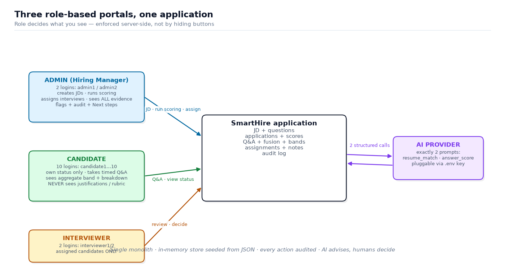

| | Admin (Hiring Manager) | Candidate | Interviewer |
|---|---|---|---|
| **Sees** | Everything: all JDs, all candidates, all scores, flags, audit | **Only their own** application + aggregate band | **Only candidates assigned to them** |
| **Does** | Create JD, run scoring, assign interviews, set "Next steps" | Take timed Q&A, check live status | Review evidence, record decision, add notes |
| **Never** | — | Sees AI justifications, rubric, raw scores | Sees unassigned candidates, manages JDs |
| **Logins** | admin1, admin2 (`admin123`) | candidate1…10 (`cand123`) | interviewer1, interviewer2 (`int123`) |

---

## 3. THE master workflow (memorize this one)

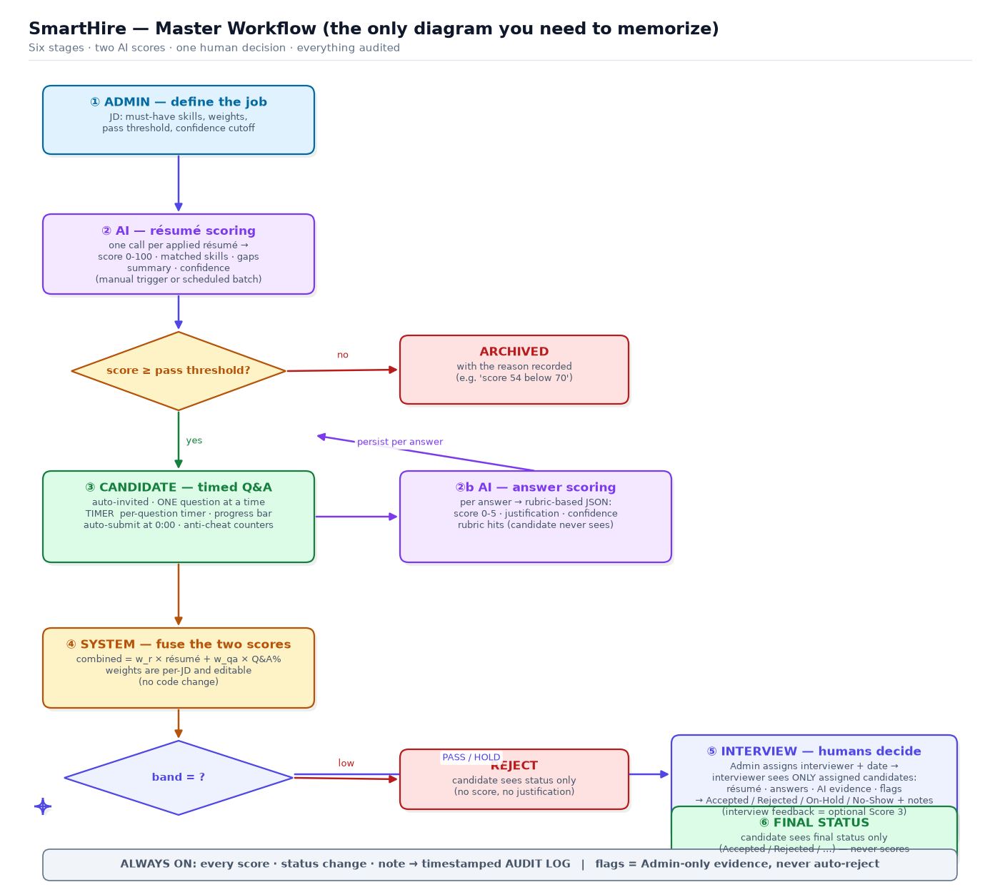

**Two-score rule:** résumé score happens first; only if it crosses the threshold does the
Q&A round unlock; the Q&A then re-scores the candidate and both merge into the final band.

**Batch scoring:** the requirement also allows resume auto-scoring to run as a **scheduled
batch across multiple JDs** (not only the manual ▶ trigger) — same AI call, triggered by a timer.

**Interview as Score 3 (clarification):** the UseCase workflow mentions
*"Interview (Score 3) → Final Total Score"*. Interpretation: the fusion of Scores 1+2
produces the PASS/HOLD/REJECT band; the interviewer's post-interview assessment is a
**third, human signal** that informs the Hiring Manager's final call. It is not an
LLM score and does not block the band. (An optional numeric Score-3 field is a
natural extension, not needed for the core demo.)

---

## 4. Screen-by-screen: what exists, what actions are on it

### 4.1 Login (shared)
One form → routes by role to the matching portal. Hard-coded seed users only, JWT token.

### 4.2 Admin Portal — screens & actions

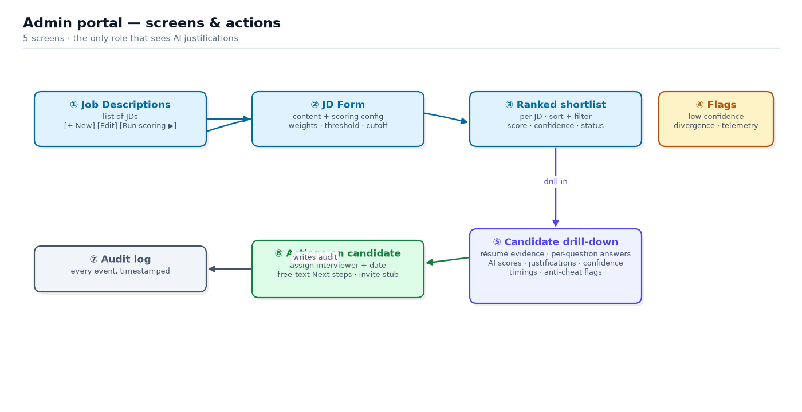

| Screen | Actions available | Rule |
|---|---|---|
| **JD list** | Create, Edit, **Run scoring** | Edit = content + scoring config, no code change |
| **Shortlist** | Sort, filter by score/status/confidence, drill-in | Ranked per JD |
| **Drill-down** | View ALL evidence (résumé, answers, AI scores, justification, confidence, **per-question timings**, flags) | Admin is the only role that sees justifications |
| **Candidate actions** | Assign interviewer + date · write "Next steps" · stub invitation (toast + log) | "Next steps" = free text e.g. "Round 2, HR discussion" |
| **Flags** | View only | confidence < 0.6 · résumé/Q&A divergence · anti-cheat counters |
| **Audit** | View only | every score, transition, note with timestamp |

### 4.3 Candidate Portal — screens & actions

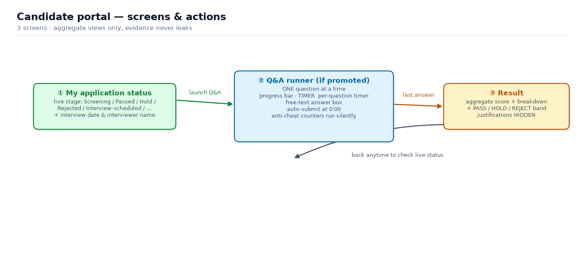

| Screen | What it shows | Actions |
|---|---|---|
| **My status** | Live stage: Filtered / Screening / Passed / Hold / Rejected / Interview-scheduled / Accepted / No-show + **interview date + interviewer name** when scheduled | Launch Q&A (only when promoted) |
| **Q&A runner** | ONE question · progress bar · per-question timer · free-text box | Submit answer; timer auto-submits at 0:00; anti-cheat counters captured silently (tab-switch · paste · **copy-of-question**) |
| **Result** | Aggregate combined score + per-category breakdown + **PASS / HOLD / REJECT band** | — |

> 🔒 The candidate **never** sees: justifications, rubric, reference answers, other candidates.

### 4.4 Interviewer Portal — screens & actions

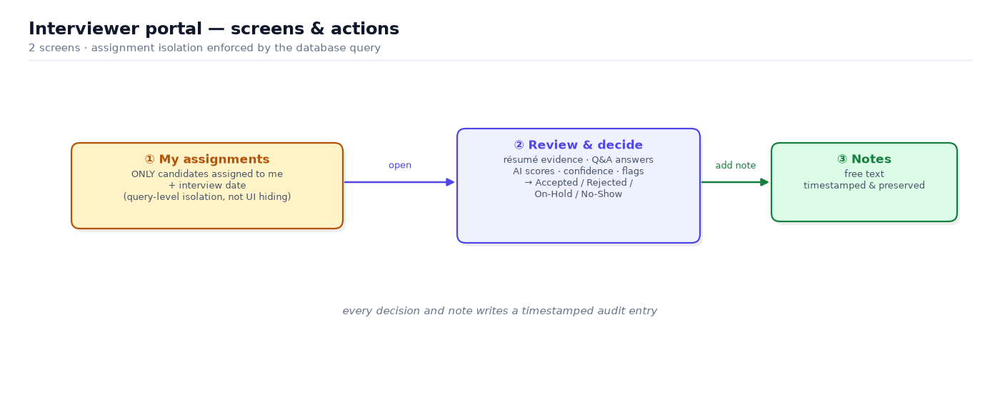

| Screen | Shows | Actions |
|---|---|---|
| **My assignments** | Only candidates assigned to me + interview date | Open review |
| **Review & decide** | Résumé evidence · Q&A answers · AI scores · confidence · flags | Toggle status: **Accepted / Rejected / On-Hold / No-Show** · add timestamped note |

---

## 5. Key flows as sequence diagrams

### 5.1 Résumé scoring (Admin action)

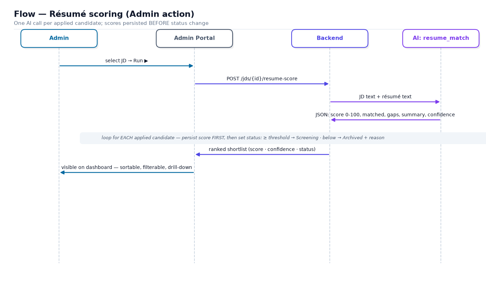

### 5.2 Q&A round (Candidate)

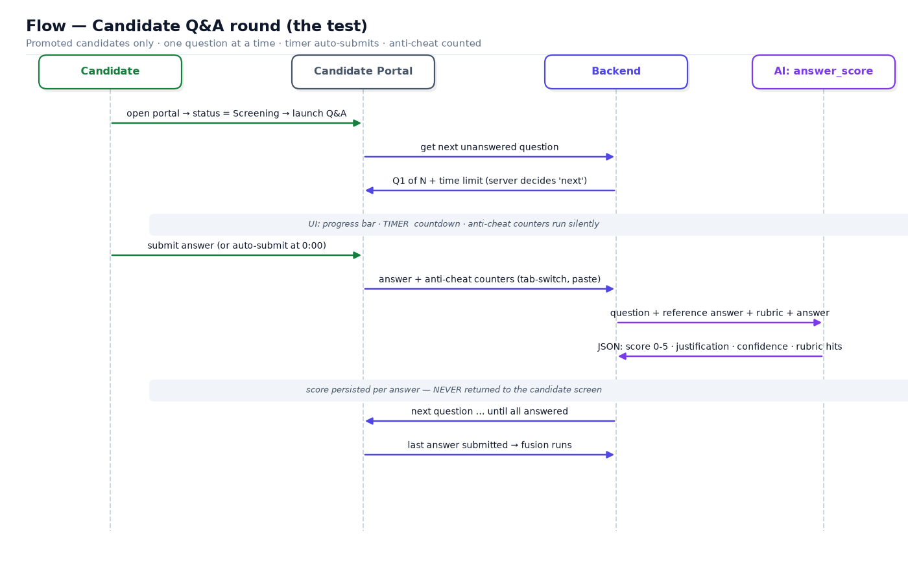

### 5.3 Fusion, band, interview, decision

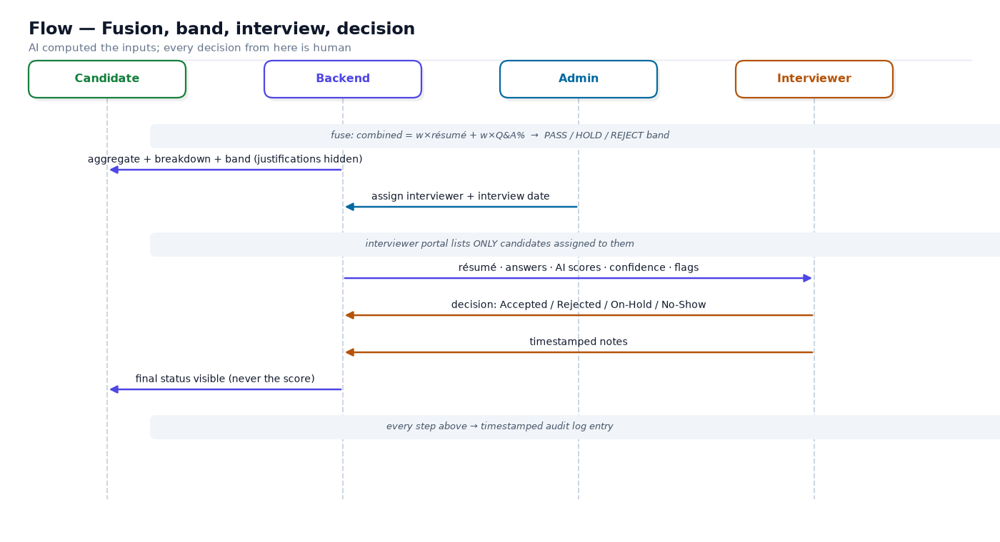

---

## 6. Data model (simplified)

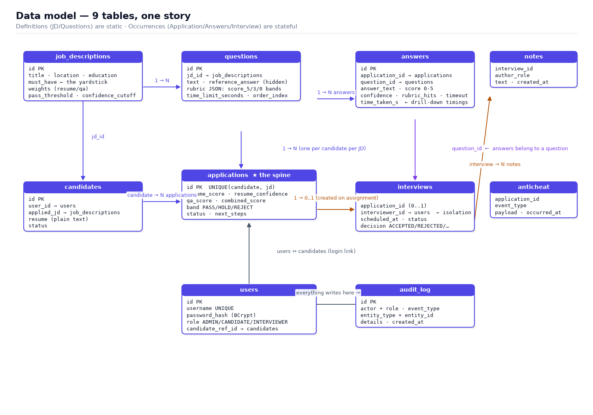

**The spine:** `applications` — it starts empty and every stage writes into it:
resume score → answers hang off it → qa + combined + band → interview hangs off it →
status tells the whole story. Definitions (`job_descriptions`, `questions`) are static;
occurrences (`applications`, `answers`, `interviews`) are stateful.

---

## 7. Score calculation — the two-score rule

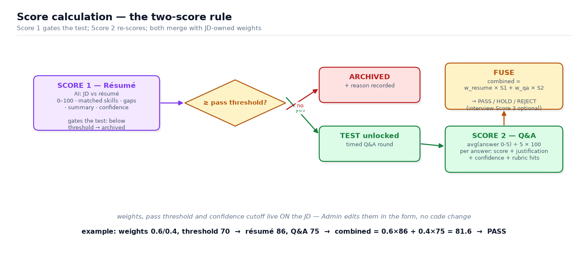

```
Score 1 (résumé)  : AI vs JD          → 0–100, gates the test
Score 2 (Q&A)     : rubric AI scoring → per answer 0–5, normalized to %
combined          : w_resume × Score1 + w_qa × Score2     (weights live on the JD)
band              : combined ≥ threshold      → PASS
                    combined ≥ 0.8×threshold → HOLD
                    else                     → REJECT
example           : weights 0.6/0.4, threshold 70 → 0.6×86 + 0.4×75 = 81.6 → PASS
```

---

## 8. Application status — the life of a candidate

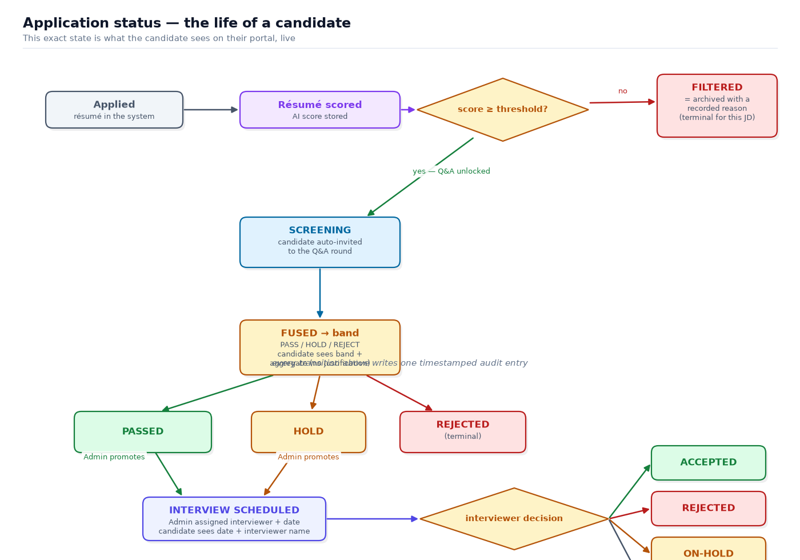

Candidate's "live status" screen = exactly this state, plus date + interviewer when scheduled.
Every transition writes one timestamped audit entry.

---

## 9. The non-negotiable rules (guardrails)

| # | Rule |
|---|---|
| 1 | Only **2 AI prompts** exist: `resume_match`, `answer_score`. Single-turn, JSON-in/JSON-out. No agents |
| 2 | Invalid AI JSON → **retry exactly once**, then fail visibly — never a retry loop |
| 3 | Candidate **never** sees justifications, rubric, reference answers, or raw prompts |
| 4 | Interviewer **only** sees assigned candidates — enforced in the database query, not the UI |
| 5 | Anti-cheat (tab-switch · paste · copy-of-question) / low-confidence / divergence flags are **Admin-only evidence**; **never** auto-reject |
| 6 | AI key lives in `.env`, never in source |
| 7 | Every score, status change, note → **timestamped audit entry** |
| 8 | Scoring is **configurable per JD** (weights, threshold, cutoff) — no code change |
| 9 | Human has the **final call** always — the interview decision is a separate human action |

---

## 10. In / out of scope (one glance)

**IN** — 3 portals · JD CRUD + editable scoring config · résumé auto-scoring (**manual trigger and/or scheduled batch**) · threshold gating ·
timed Q&A (one-at-a-time, progress, auto-submit) · rubric AI scoring · weighted fusion to band ·
ranked shortlist (sort/filter) · admin drill-down · interview assignment · 4-way decision + notes ·
audit log · anti-cheat telemetry · stubbed invitations · pluggable LLM via env · seed JSON at startup ·
in-memory store · per-question timings in drill-down · scoring response in **2–3 s** ·
status visible in **near-realtime** (refresh/polling; websockets unnecessary for demo).

**OUT** — agentic/multi-turn AI · real email/SMS · PDF/DOCX parsing · microservices/queues ·
OAuth/SSO · auto-reject on flags.

---

## 11. Seed data (what the demo must contain)

| Item | Count | Notes |
|---|---|---|
| Job descriptions | 3 | Frontend (Mumbai, 2y, thr 70) · Java Backend (Bengaluru, 3y, thr 72) · Python (Pune, 2y, thr 70) |
| Questions | 6 per JD | each with reference answer + **banded rubric** (score_5 / score_3 / score_0) |
| Candidates | 10 resumes | designed edge cases: overqualified, missing-TypeScript, contradictory over-claim, low-confidence |
| Users | 14 | 2 admin (`admin123`) · 10 candidates (`cand123`) · 2 interviewers (`int123`) |

**Demo bar (Definition of Done):** ≥2 JDs × 5 candidates each → full walk-through:
score → gate → Q&A → fuse → band → assign → decide, all visible in audit.

---

---

## 12. Requirement ambiguities — how they were resolved

| UseCase says | Also says | Resolution |
|---|---|---|
| "2 Admins, 3 Candidates, 2 Interviewers" (In-Scope) | "Users - 14 hardcoded logins, 10 candidates" (DataSet) | **14 users / 10 candidates** — the dataset section is authoritative |
| "The dataset contains 2 JDs, 8 resumes" | "Job descriptions - 3 JDs", "Candidates - 10 resumes" | **3 JDs / 10 resumes** |
| "resume_match invoked when Admin opens a JD" | "invoked as a batch job at specific intervals" | **Both supported concepts**: manual trigger is the demo path; batch is a timer around the same call |
| "calculate the ATS score" (Admin portal) | "resume_match returns score 0-100, matched skills, gaps, summary" | **Same thing** — resume_match *is* the ATS score; naming only |
| "Interview (Score 3) → Final Total Score" | Fusion produces PASS/HOLD/REJECT from Scores 1+2 | Band = fusion of 1+2; interview assessment is a human **Score 3** feeding the final decision (see §3) |
| "UI updates in realtime" | demo scope | Polling/refresh is sufficient; no websockets |
| "REST CRUD for JDs, Job role, Resumes, Questions, Candidates and Status" | (nothing else) | **JD = full CRUD**; questions/candidates/status are **seed + read + state-transitions via workflow actions** (no free-form CRUD needed by any screen) |

*Reading order if you're new: §1 → §3 → §4 → §7 → §8. That covers 90% of the system.*
*This document is the readable contract; `SmartHire_LLD_and_Data_Model_glm_5.3.md` describes how the code satisfies it.*
